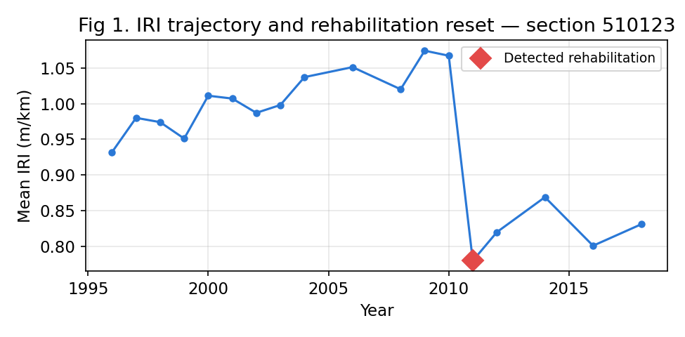

# Appendix A — Dataset Preparation and Feature Derivation

This document records how the two consolidated modelling tables were constructed from
**LTPP Standard Data Release 39 (SDR 39)**, so that the pipeline is fully reproducible.
It reproduces the appendix that was removed from the manuscript to meet the TRB Annual
Meeting page limit and the rule that appendices are not permitted in the paper itself.

> **Data source.** The raw data is publicly available from FHWA **InfoPave** (LTPP SDR 39).
> Only the *derived* modelling tables are distributed in this repository; the raw LTPP
> release is not re-hosted, in keeping with LTPP's data-use terms.

---

## A.1 Condition table (section-level structure, traffic, climate, and distress)

**Structural features** were derived from the LTPP `SECTION_LAYER_STRUCTURE` table. The
total number of layers was taken as the highest layer count recorded under a given section.
Layer descriptors were used to flag treatment: a layer coded **"TB"** indicates a treated
base, and **"EF"** indicates the presence of an engineering fabric. Total base thickness was
computed by summing the representative thicknesses of the base layers (granular subbase, GS,
and granular base, GB).

**Traffic features** were computed from the SDR 39 traffic database (`Traffic.accdb`) using
the `TRF_ESAL_COMPUTED` and `TRF_TREND` tables. For each section ID, the per-section average
of `CMLTV_VOL_HEAVY_TRUCKS_TREND`, `AADTT_ALL_TRUCKS_TREND`, `ANNUAL_TRUCK_VOLUME_TREND`, and
`KESAL_YEAR` was taken.

**Condition targets** — mean IRI and rut depth — were computed in the same manner from the
SDR 39 monitoring database (`Monitoring.accdb`) using the `ANALYSIS_IRI` and
`ANALYSIS_RUTTING` tables.

**Climate features** were gathered from the SDR 39 Climate project. This involved loading
several Excel files — `CLM_VWS_HUMIDITY_ANNUAL.xlsx`, `CLM_VWS_PRECIP_ANNUAL.xlsx`,
`CLM_VWS_TEMP_ANNUAL.xlsx`, and `CLM_VWS_WIND_ANNUAL.xlsx`. From these raw files, specific
columns (e.g., `MAX_ANN_HUM_AVG`, `TOTAL_ANN_PRECIP`, `MEAN_ANN_TEMP_AVG`,
`MEAN_ANN_WIND_AVG`) were extracted and averaged per `VWS_ID`. These processed climate
datasets were combined using inner merges on `VWS_ID`. A `location` column was then created
by extracting the first two digits of `VWS_ID`, and the merged frame was grouped by
`location` to compute the mean of its numeric columns, yielding aggregated climate
information **per location**.

The streams were combined with a pandas inner merge on the common six-digit section ID,
yielding the **2,070-section condition table** used in Part I.

---

## A.2 Rehabilitation-interval table (time-based features and target)

Because the Part II target is a time quantity, time-related features were added to the
section descriptors. From the available time-series data, rates of change (derivatives with
respect to time) were computed for `KESAL_YEAR_RATE`, `AADTT_ALL_TRUCKS_TREND_RATE`, and
`CMLTV_VOL_HEAVY_TRUCKS_TREND_RATE`.

The IRI and rut-depth change rates were computed differently, because a rehabilitation action
changes IRI and rut depth abruptly and would otherwise corrupt a simple slope. Rehabilitation
effects were first detected as a significant drop in the distress value between consecutive
years. The deterioration rate was then computed as the **average of the increase rates in the
segments immediately before and after each detected rehabilitation event** (Figure A1),
isolating the genuine deterioration trend from the rehabilitation-induced resets.

Finally, the **average rehabilitation-year gap** — the Part II target — was computed for each
section from its rehabilitation history: rehabilitation events were identified from the LTPP
maintenance-and-rehabilitation records, reduced to one event per calendar year, and the gaps
between consecutive rehabilitation years were averaged. A section therefore contributes a
target value only when it has **at least two rehabilitation events in distinct years**: a
section with two events yields a single gap (its interval), while a section with three yields
the mean of two consecutive gaps.

**Figure A1.** Derivation of the IRI/rut deterioration rate around a detected rehabilitation
event: the rate is the average of the pre-event and post-event increase rates, so the
rehabilitation-induced drop does not bias the trend.
